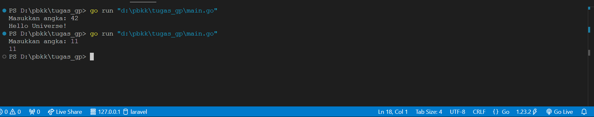
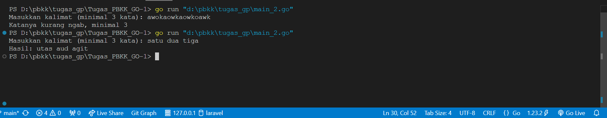

# Tugas_PBKK_GO-1
## Soal 1
### Hello Universe!
Buatlah kode dengan bahasa pemrograman Golang. Program ini menerima input berupa angka. Jika memberikan input angka 42, maka program akan memberikan output Hello Universe!. Jika angka selain 42, program akan memberikan output angka yang diinputkan.

### Langkah-Langkah
- Program ini meminta input dari pengguna dan menyimpannya dalam variabel input.
- Jika nilai input adalah 42, maka program akan mencetak "Hello Universe!".
- Jika nilai input bukan 42, maka program akan mencetak angka yang dimasukkan.

### Contoh Input Output

## Soal 2
### Reverse Words
Buatlah kode dengan bahasa pemrograman Golang. Program ini menerima input berupa kalimat dengan minimal 3 kata. Setiap kata dalam kalimat akan dibalik secara individual tanpa mengubah urutan kata. Jika kalimat yang dimasukkan memiliki kurang dari 3 kata, program akan memberikan pesan error.

### Langkah-Langkah
- Program meminta input dari pengguna berupa kalimat.
- Kalimat dipecah menjadi kata-kata menggunakan strings.Fields.
- Jika jumlah kata kurang dari 3, program menampilkan pesan error.
- Jika kalimat memiliki 3 kata atau lebih, program membalik setiap kata secara individual menggunakan fungsi reverseWord.
- Kata-kata yang telah dibalik digabungkan kembali dan dicetak sebagai hasil.

### Contoh Input Output

